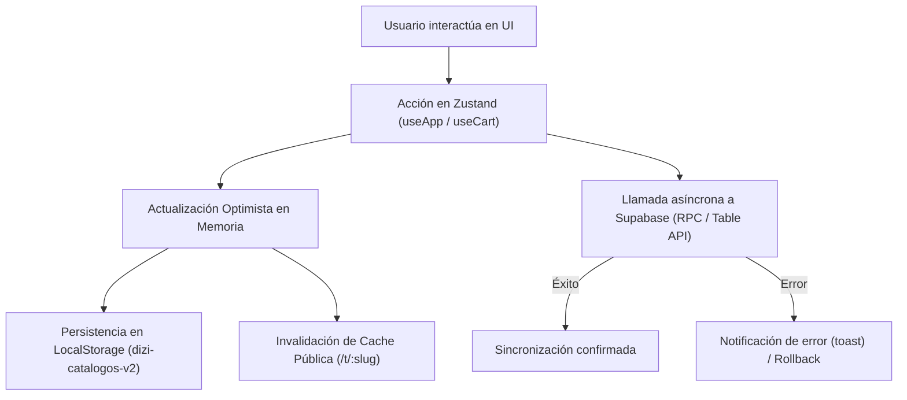

# Arquitectura del Sistema DIZI (Catálogo Dinámico SAAS)

Este documento describe la arquitectura técnica, el modelo de datos, la gestión de estado y los flujos de integración de la plataforma **DIZI**.

---

## 1. Visión General del Stack Tecnológico

| Capa | Tecnología | Propósito |
|---|---|---|
| **Framework Frontend** | React 18 + TypeScript | Renderizado de interfaz reactiva y tipado estático estricto. |
| **Enrutamiento** | TanStack Router (File-Based) | Enrutamiento declarativo basado en archivos (`src/routes`), con precarga y guardias `beforeLoad`. |
| **Estado Global** | Zustand (con middleware `persist`) | Manejo de tiendas (`useApp`), carritos de compra (`useCart`) y sincronización con `localStorage`. |
| **Backend & Base de Datos** | Supabase (PostgreSQL + Auth + Storage) | Persistencia relacional, autenticación segura (JWT) y almacenamiento de imágenes CDN. |
| **Estilos y Componentes** | Tailwind CSS + Radix UI (Shadcn/UI) + Lucide Icons | Diseño responsive, componentes accesibles y diseño visual personalizable. |
| **Mapas e Interactividad** | Leaflet + OpenStreetMap (Nominatim API) | Geolocalización de tiendas, buscador de direcciones y pines interactivos. |
| **Exportación & Medios** | Canvas API + jsPDF + html2canvas | Compresión y miniaturas de imágenes en cliente, generación de catálogos en PDF. |

---

## 2. Estructura y Dominios de la Aplicación

El proyecto se organiza bajo las siguientes áreas funcionales:

```text
src/
├── components/
│   ├── admin/           # Componentes del panel del comercio (Sidebar, Wizard, Suscripciones)
│   ├── public/          # Experiencia del comprador (PublicCatalog, Visor de imágenes, Exportador PDF)
│   └── ui/              # Sistema de diseño base (botones, diálogos, inputs, tooltips)
├── hooks/               # Custom hooks reutilizables (detección móvil, etc.)
├── lib/                 # Núcleo de lógica y datos:
│   ├── types.ts         # Modelos de dominio e interfaces TypeScript
│   ├── store.ts         # Tienda Zustand principal y estado del carrito
│   ├── supabase.ts      # Cliente Supabase y subida de archivos binarios/WebP
│   ├── auth.ts          # Gestión de sesión, roles y guardias de seguridad
│   ├── image-utils.ts   # Compresión en canvas y verificación de aspectos
│   └── utils.ts         # Funciones matemáticas y utilidades de color
└── routes/              # Rutas de TanStack Router:
    ├── admin.*          # Vistas de gestión del dueño de tienda (/admin/productos, /admin/diseno, /admin/link-bio)
    ├── super.*          # Panel de administración de plataforma (/super/tiendas, /super/promociones)
    ├── t.$slug.tsx      # Catálogo público web para clientes (/t/mi-tienda)
    ├── bio.$slug.tsx    # Página interactiva Link-in-Bio (/bio/mi-tienda)
    └── index.tsx        # Landing page promocional de DIZI
```

---

## 3. Modelo de Datos y Entidades Principales

### 3.1 Tienda (`Store`)
Representa a cada comercio dentro del sistema multi-inquilino (*multi-tenant*).
- **Identidad**: `id` (UUID), `slug` (identificador único en URL pública), `name`, `phone`, `countryCode`.
- **Diseño del Catálogo**: `model` (plantilla visual: minimalista, portada, magazine, etc.), `brandColor`, `bgColor`, `textColor`, `catalogTypography`, `cardStyle`, `isDark`.
- **Link-in-Bio**: `bioLinksEnabled`, `bioDescription`, `bioLogo`, `bioBanner`, `bioTheme`, `bioTypography`, `bioButtonStyle`, `quickLinks`.
- **Geolocalización**: `locationAddress`, `locationLat`, `locationLng`, `showMap`.
- **Suscripción**: `plan` (`semilla` \| `emprendedor` \| `pro` \| `ilimitado`), `planExpiresAt`, `subscriptionStatus` (`active` \| `trial` \| `expired` \| `cancelled`).

### 3.2 Producto (`Product`) y Variantes (`ProductVariation`)
- Pertenece a una tienda (`store_id`) y opcionalmente a una categoría (`category_id`).
- Contiene precio regular (`price`), precio tachado de oferta (`originalPrice`), visibilidad (`visible`) y orden personalizado (`sortOrder`).
- **Variantes**: Permite opciones hijas (talla, color, sabor) con su propio precio e imagen dedicada.

### 3.3 Categoría (`Category`)
- Agrupa productos dentro de la tienda para filtrado en el catálogo.

### 3.4 Enlaces Rápidos (`QuickLink`)
- Enlaces sociales y personalizados mostrados en la página Link-in-Bio de la tienda.

---

## 4. Gestión de Estado y Ciclo de Vida (`src/lib/store.ts`)

La aplicación implementa una arquitectura híbrida de estado: **Zustand + LocalStorage + Supabase**.



### Principios de Sincronización:
1. **Actualización Optimista**: La interfaz responde de forma instantánea al usuario; la persistencia remota en Supabase se ejecuta en segundo plano.
2. **Debounce en Reordenamiento**: Al arrastrar y reordenar productos (`swapProductsOrder`), los cambios se acumulan en un temporizador de 1 segundo para evitar saturar la base de datos con peticiones individuales.
3. **Limpieza y Cuota de Almacenamiento**: Al guardar en `localStorage`, se filtran las imágenes en base64 temporales para no exceder la cuota de 5 MB del navegador.
4. **Procesamiento de Imágenes en Cliente**: Toda imagen subida se convierte a formato WebP optimizado en el navegador antes de enviarse a Supabase Storage (`/images/{storeId}/...`), reduciendo el consumo de ancho de banda y acelerando la carga.

---

## 5. Arquitectura de Enrutamiento y Seguridad (`src/lib/auth.ts`)

TanStack Router gestiona las rutas con protección basada en roles:

- **Rutas Públicas**:
  - `/t/$slug`: Catálogo de la tienda para compradores.
  - `/bio/$slug`: Página de enlaces tipo Link-in-Bio.
  - `/`: Landing page de DIZI.
- **Rutas de Comercio (`/admin/*`)**:
  - Protegidas por `beforeLoad`. Verifican sesión activa y asignan la tienda del usuario autenticado.
- **Rutas de Super Administrador (`/super/*`)**:
  - Verifican que el usuario posea el rol `super_admin` en sus metadatos de autenticación (`app_metadata.role`).
