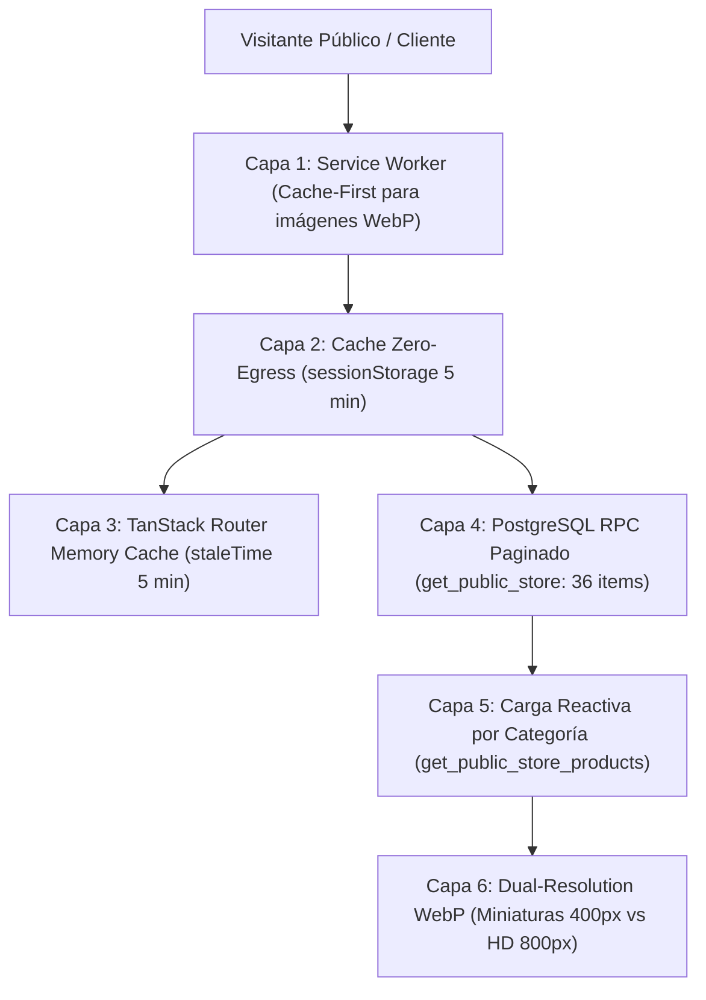

# Manual Técnico de Optimizaciones y Arquitectura Zero-Egress en Dizi

Este documento detalla todas las capas de optimización de rendimiento, reducción de egress en base de datos PostgreSQL, compresión de almacenamiento (Storage) y experiencia de usuario implementadas en la plataforma **Dizi**.

---

## 1. Mapa de Capas de Optimización

---

## 2. Inventario de Optimizaciones Implementadas

### Capa 1: Carga Inicial Ultra-Ligera (Paginación Inicial de 36 Productos)
* **Objetivo:** Evitar que una tienda con 300+ productos descargue el catálogo completo en la primera visita.
* **Mecanismo:** El procedimiento almacenado `get_public_store` entrega únicamente los primeros **36 productos** en el render inicial.
* **Ahorro de Egress:** Reduce el peso de la primera consulta de ~450 KB a **~35 KB (92% de ahorro)**.
* **Archivos:** `src/routes/t.$slug.tsx`, `src/routes/bio.$slug.tsx`, `supabase/migrations/20260825000000_lazy_load_public_store_egress.sql`.

---

### Capa 2: Descarga Segmentada y Carga Reactiva por Categoría (`p_category_id`)
* **Objetivo:** Permitir que clientes que seleccionan una categoría específica (ej. *Acrílico Fabric*, *Cerámica*) vean sus productos de inmediato sin tener que descargar los 350 productos de la tienda.
* **Mecanismo:** 
  - PostgreSQL calcula y entrega el `product_count` real por categoría en `get_public_store`.
  - Si el usuario toca una categoría que tiene 0 productos en la memoria local pero `productCount > 0`, el frontend dispara inmediatamente `get_public_store_products` filtrando por `p_category_id`.
  - Muestra un spinner animado durante la descarga y renderiza la cuadrícula de inmediato.
* **Archivos:** `src/components/public/PublicCatalog.tsx`, `supabase/migrations/20260825010000_category_counts_and_server_search.sql`.

---

### Capa 3: Paginación Dinámica en Cuadrícula y Scroll Infinito Acotado
* **Objetivo:** No saturar el DOM ni el ancho de banda del celular mientras el cliente navega.
* **Mecanismo:**
  - El renderizado en pantalla inicia en **12 productos visibles** (`visibleLimit: 12`).
  - Al hacer scroll, se van mostrando bloques de 12 en 12 (`12 ➔ 24 ➔ 36`).
  - Cuando se agotan los productos en memoria y existen más en la base de datos, `loadMoreProducts` solicita el siguiente bloque de 24 a PostgreSQL.
* **Archivos:** `src/components/public/PublicCatalog.tsx`.

---

### Capa 4: Búsqueda Global en Servidor con Debounce
* **Objetivo:** Búsqueda instantánea en catálogos grandes sin descargar todos los productos a memoria.
* **Mecanismo:** Al escribir 2 o más letras en el buscador, un temporizador debounce de 300 ms consulta `get_public_store_products` enviando `p_search_query` con búsqueda ILIKE en PostgreSQL.
* **Archivos:** `src/components/public/PublicCatalog.tsx`.

---

### Capa 5: Caché Zero-Egress en Sesión (`sessionStorage`)
* **Objetivo:** Consumo 0 Bytes de base de datos durante la navegación activa del visitante.
* **Mecanismo:**
  - Al recibir la respuesta de la tienda, se almacena en `sessionStorage` con clave `dizi_store_cache_<slug>` y timestamp.
  - Navegaciones entre el catálogo, Bio-Link, filtros, y recargas dentro de una ventana de **5 minutos** se resuelven 100% desde la memoria del navegador.
* **Impacto:** Visitas recurrentes y navegación interna consumen **0 peticiones a Supabase**.
* **Archivos:** `src/routes/t.$slug.tsx`, `src/routes/bio.$slug.tsx`.

---

### Capa 6: Service Worker con Estrategia Cache-First
* **Objetivo:** Eliminar peticiones repetidas al almacenamiento de Supabase Storage.
* **Mecanismo:** El Service Worker (`public/sw.js`) intercepta peticiones GET de imágenes (`.webp`, `.png`, `.jpg`, `.svg`), sirviendo copias cacheadas desde `CacheStorage` con política *Stale-While-Revalidate*.
* **Archivos:** `public/sw.js`, `src/lib/service-worker.ts`.

---

### Capa 7: Miniaturas Dual-Resolution WebP (400px vs 800px HD)
* **Objetivo:** Reducir el peso de las imágenes en un 95%.
* **Mecanismo:**
  - Al subir una foto desde el panel de administración, el cliente genera automáticamente dos versiones:
    1. Miniatura para cuadrícula: `_thumb.webp` (400px, peso: **12 KB – 15 KB**).
    2. Imagen HD para modal de detalle y zoom: `.webp` (800px, peso: **30 KB – 45 KB**).
  - La cuadrícula pública solicita exclusivamente `_thumb.webp`.
* **Archivos:** `src/lib/image-utils.ts`, `src/components/public/PublicCatalog.tsx`.

---

### Capa 8: Lazy Loading Nativo de Imágenes
* **Objetivo:** Evitar que el navegador descargue fotos de productos que el usuario aún no ha scrolleado.
* **Mecanismo:** Todas las etiquetas `` incluyen `loading="lazy"` y `decoding="async"`. El navegador únicamente solicita los bytes de la imagen cuando el elemento se acerca al viewport visual.
* **Archivos:** `src/components/public/PublicCatalog.tsx`.

---

## 3. Matriz de Cobertura de Pruebas de Rendimiento

| Prueba | Tipo | Archivo | Estado |
| :--- | :--- | :--- | :---: |
| Conteo real de categorías PostgreSQL | Vitest | `src/routes/__tests__/category-lazy-loading.test.ts` | ✅ **Pasa** |
| Fetch bajo demanda por `category_id` | Vitest | `src/routes/__tests__/category-lazy-loading.test.ts` | ✅ **Pasa** |
| Paginación en memoria vs remota | Vitest | `src/routes/__tests__/lazy-load-egress.test.ts` | ✅ **Pasa** |
| Zero-Egress en SessionStorage | Playwright E2E | `tests/e2e/lazy-loading-egress.spec.ts` | ✅ **Pasa** |
| Clic en categoría no cargada inicialmente | Playwright E2E | `tests/e2e/lazy-loading-egress.spec.ts` | ✅ **Pasa** |
| Service Worker intercepta GET | Playwright E2E | `tests/e2e/lazy-loading-egress.spec.ts` | ✅ **Pasa** |
| Scroll progresivo en cuadrícula | Playwright E2E | `tests/e2e/lazy-loading-egress.spec.ts` | ✅ **Pasa** |
