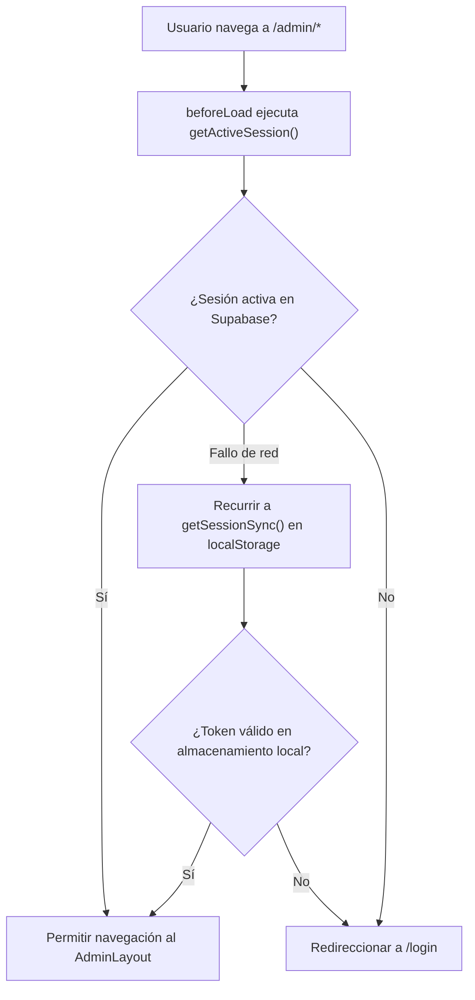

# Módulo de Administración: Panel del Comercio (/admin)

Este documento describe la arquitectura, componentes, flujos de datos y herramientas de gestión del panel de administración del comercio en la plataforma **DIZI**.

---

## 1. Visión General y Arquitectura de Rutas

El panel de administración (`/admin/*`) proporciona al dueño de tienda el control total sobre su catálogo, diseño, enlaces y configuración comercial.

| Ruta | Archivo Fuente | Propósito |
|---|---|---|
| `/admin` | `src/routes/admin.tsx` | Layout contenedor, validación de sesión (`beforeLoad`), menú móvil y asistente de onboarding. |
| `/admin/dashboard` | `src/routes/admin.dashboard.tsx` | Panel de métricas (visitas, clics a WhatsApp), estado de suscripción y códigos QR. |
| `/admin/productos` | `src/routes/admin.productos.tsx` | Gestión de inventario (CRUD), variantes, categorías, subida de fotos y ordenamiento. |
| `/admin/diseno` | `src/routes/admin.diseno.tsx` | Estudio de apariencia: plantillas, tipografías, banners, colores de marca y vista previa en vivo. |
| `/admin/link-bio` | `src/routes/admin.link-bio.tsx` | Editor de Bio-Link: botones sociales, geolocalización con mapa interactivo y previsualizador móvil. |
| `/admin/configuracion`| `src/routes/admin.configuracion.tsx` | Datos del comercio, WhatsApp, horarios, métodos de pago y datos fiscales. |
| `/admin/plan` | `src/routes/admin.plan.tsx` | Estado del plan contratado, límites de productos, canje de invitaciones y mejoras. |
| `/admin/reclamaciones`| `src/routes/admin.reclamaciones.tsx` | Libro de Reclamaciones virtual obligatorio por ley (INDECOPI). |

---

## 2. Flujo de Seguridad y Guardia de Sesión (`src/routes/admin.tsx`)

Todas las rutas hijas de `/admin` están protegidas por el guardia `beforeLoad`:

### Características del Layout:
- **Barra lateral colapsable (`AdminSidebar.tsx`)**: Basada en Radix UI (`SidebarProvider`), colapsable a modo icono en pantallas medianas.
- **Navegación inferior en móviles**: Barra de accesos directos fija (`Dashboard`, `Productos`, `Link en Bio`, `Configuración`, `Más`) para ergonomía táctil en smartphones.
- **Modo Suplantación (`impersonatedBy`)**: Cuando un super-administrador ingresa a auditar una tienda, se despliega una barra de advertencia superior con botón para finalizar la sesión de soporte.
- **Asistente de Bienvenida (`OnboardingWizard.tsx`)**: Si la tienda tiene `onboardingCompleted: false`, se abre automáticamente un modal guiado de 4 pasos (nombre, WhatsApp, plantilla y primer producto).

---

## 3. Gestión de Productos e Inventario (`admin.productos.tsx`)

Es uno de los módulos más completos de la plataforma, encargado de:

1. **Operaciones CRUD**: Creación, edición, duplicación y eliminación de productos y categorías.
2. **Sistema de Variantes (`ProductVariation`)**: Permite añadir opciones hijas (ej: tallas S, M, L o colores) con precio diferenciado y fotografía individual.
3. **Optimización Guiada de Imágenes (`ImageUploadGuided.tsx` / `image-utils.ts`)**:
   - Verifica que las fotos cumplan la proporción recomendada según la plantilla activa (`getImageSpec`).
   - Convierte automáticamente las fotos a formato WebP ligero (~35 KB) antes de subirlas a Supabase Storage.
   - Genera una miniatura complementaria (`_thumb.webp`) a 400px para carga ultrarrápida en la grilla.
4. **Reordenamiento Táctil y Arrastre (`swapProductsOrder`)**:
   - Permite arrastrar productos para alterar su posición en el catálogo.
   - Aplica actualización optimista inmediata en la UI y sincroniza con Supabase mediante un temporizador *debounce* de 1 segundo.
5. **Limpieza de Productos de Demostración (`isSample`)**:
   - Cuando el usuario crea su primer producto real, el sistema elimina automáticamente los productos de ejemplo precargados para evitar confusión.

---

## 4. Estudio de Diseño y Apariencia (`admin.diseno.tsx`)

Permite personalizar completamente la identidad visual del catálogo digital:

- **Estructuras de Diseño (`DESIGN_STRUCTURES`)**: Selector entre más de 12 plantillas arquitectónicas (Grilla, Portada, Editorial, Hero, Boutique, Tiles, etc.).
- **Paletas y Contraste Automático**:
  - Selector de color de marca (`brandColor`), color de fondo (`bgColor`) y tarjetas (`cardBg`).
  - Cálculo de luminancia (`hexLuminance`) para asegurar contraste legible y alternar modo oscuro (`isDark`).
- **Tipografías y Bordes**:
  - Selección de familias tipográficas: `sans` (moderna/geométrica), `serif` (editorial/lujo), `rounded` (amigable/cálida) y `modern`.
  - Estilos de tarjeta: estándar, plano, con sombra o curvado.
- **Gestor de Banners**: Soporta múltiples imágenes de cabecera separadas por `|||` con estilos de recorte (directo, enmarcado o curvado).
- **Barra de Anuncios (Cintillo Promocional)**: Configuración de texto, color, enlace de destino y animación tipo marquesina (exclusivo para planes Pro e Ilimitado).

---

## 5. Editor de Link-in-Bio (`admin.link-bio.tsx`)

Configurador de la página de enlaces para redes sociales:

- **Enlaces Sociales Automáticos**: Detecta enlaces a WhatsApp, Instagram, Facebook, TikTok, LinkedIn, YouTube y Spotify asignando el icono y paleta oficial.
- **Enlaces Personalizados**: Creación de botones con color de fondo, texto y miniatura propia.
- **Geolocalización y Mapa Leaflet**:
  - Buscador de direcciones con autocompletado en tiempo real conectado a la API de **OpenStreetMap (Nominatim)**.
  - Mapa interactivo con pin arrastrable (`draggable marker`) para fijar la ubicación exacta del local físico.
- **Previsualizador Móvil en Vivo**: Maqueta interactiva de smartphone a la derecha que refleja cada cambio de texto, tema y botones en tiempo real.

---

## 6. Configuración y Negocio (`admin.configuracion.tsx`)

Control de los aspectos operativos y comerciales:

- **Canales de Atención**: Número de WhatsApp con prefijo internacional, enlace directo y mensaje predeterminado.
- **Horarios de Atención**: Programación de apertura y cierre semanal con indicador visual de "Abierto ahora" en el catálogo.
- **Métodos de Pago**: Habilitación de billeteras digitales (Yape, Plin), transferencias bancarias, tarjetas o pago contra entrega con instrucciones para el comprador.
- **Libro de Reclamaciones**: Activación de la hoja de reclamaciones virtual, número de RUC, Razón Social y domicilio fiscal conforme a las exigencias de INDECOPI en Perú.

---

## 7. Suscripciones y Planes (`admin.plan.tsx`, `SubscriptionManager.tsx`)

- **Monitor de Recursos**: Visualización de productos ocupados versus el límite del plan y cálculo estimado de consumo de transferencia de datos (*Egress*).
- **Ciclo de Vida del Plan**: Indicadores de días restantes, periodo de gracia (3 días de tolerancia antes de limitar productos) y gracia de diseño (15 días para mantener plantilla).
- **Activación por Invitación**: Campo de canje para tokens de cortesía o promociones gestionadas por el Super Admin.
