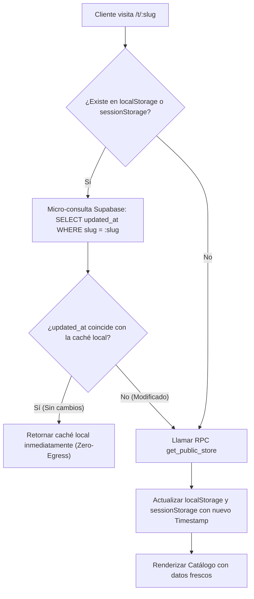

# Módulo Público: Catálogo del Cliente, Link-in-Bio y Exportador PDF

Este documento describe la arquitectura, componentes, flujos de datos y optimizaciones de la experiencia pública para los compradores en la plataforma **DIZI**.

---

## 1. Visión General y Rutas Públicas

La experiencia del comprador está compuesta por dos rutas principales en **TanStack Router**:

| Ruta | Archivo Fuente | Propósito |
|---|---|---|
| `/t/$slug` | `src/routes/t.$slug.tsx` | Catálogo interactivo de la tienda, carrito de compras, filtros y checkout vía WhatsApp. |
| `/bio/$slug` | `src/routes/bio.$slug.tsx` | Página de enlaces tipo Link-in-Bio, enlaces sociales, mapa interactivo y vitrina rápida. |

Ambas rutas comparten el componente base `PublicCatalog.tsx` operando en dos modos distintos: `mode="catalog"` y `mode="bio"`.

---

## 2. Estrategia de Caché Inteligente y Ahorro de Egress (Zero-Egress)

Para minimizar el consumo de ancho de banda y la latencia en dispositivos móviles, ambas rutas implementan una estrategia de caché en dos niveles:

### Características Clave:
1. **Micro-consulta de validación**: Solo transfiere ~100 bytes en lugar de volver a descargar el JSON completo de productos y categorías en cada visita.
2. **Resiliencia ante caídas de red**: Si la conexión falla o se agota el tiempo de espera (18 segundos), se utiliza la caché previa guardada en el dispositivo en lugar de bloquear al usuario.
3. **Invalidación instantánea**: Cuando el comerciante realiza cambios en su panel (`/admin/*`), la función `invalidateStorePublicCache(slug)` purga inmediatamente estas claves para que la siguiente visita recargue los datos actualizados.

---

## 3. Catálogo Digital Interactivo (`PublicCatalog.tsx`)

`PublicCatalog.tsx` es el componente central de la experiencia de compra. Sus principales responsabilidades son:

### 3.1 Personalización de Temas y Modelos Visuales
Soporta múltiples layouts de catálogo según el modelo configurado en la tienda:
- **Minimalista / Clásico**: Grilla limpia de productos con tarjetas estándar.
- **Portada / Banner Grid**: Producto o colección destacada en cabecera panorámica seguida de grilla.
- **Editorial / Magazine**: Enfoque tipográfico con imágenes apaisadas de alta calidad.
- **Boutique / Spotlight**: Presentación de gran formato para productos exclusivos.
- **Tiles / Diagonal / Arch**: Variaciones geométricas para negocios con fuerte identidad visual.

### 3.2 Búsqueda, Filtros y Navegación
- **Buscador en tiempo real**: Filtra instantáneamente por nombre, descripción y etiquetas (`tags`).
- **Carrusel de Categorías**: Permite alternar entre secciones con desplazamiento suave y conteo de productos.
- **Filtro de Precios**: Deslizador de rango de precio mínimo y máximo cuando la tienda tiene habilitada la opción `priceFilterEnabled`.

### 3.3 Detalle de Producto y Variantes
- **Modal de Producto**: Muestra descripción extendida, precio regular y de oferta, y galería de imágenes.
- **Selector de Variantes**: Permite al cliente elegir talla, color o presentación (`ProductVariation`), actualizando dinámicamente el precio y la foto correspondiente.
- **Zoom de Imagen (`ImageZoomModal.tsx`)**: Permite ampliar fotos hasta 4.5x con gestos táctiles (*pinch-to-zoom*, doble toque y arrastre).

### 3.4 Carrito de Compras y Checkout por WhatsApp
- **Persistencia Local (`useCart`)**: Los productos añadidos se conservan en `localStorage` bajo `dizi-carts-v1` por cada tienda.
- **Generación del Mensaje de WhatsApp**: Al presionar "Pedir por WhatsApp", el sistema estructura un mensaje formateado con:
  1. Saludo y encabezado con el nombre de la tienda.
  2. Lista detallada de productos, cantidades, variantes seleccionadas y subtotales.
  3. Total final a pagar en moneda local.
  4. Datos de entrega o recojo especificados por el cliente.
  5. Enlace directo hacia la API de WhatsApp (`https://wa.me/{countryCode}{phone}?text={mensaje}`).

---

## 4. Página Link-in-Bio (`bio.$slug.tsx`)

Diseñada como la tarjeta de presentación digital del negocio para perfiles de Instagram, TikTok y WhatsApp Business:

- **Enlaces Rápidos (`QuickLink`)**: Botones hacia WhatsApp, redes sociales, menú externo, reservas o sitios web con estilos personalizables (sólido, contorno, cristal/glass).
- **Mapa Interactivo (Leaflet)**: Si la tienda tiene configurada una dirección y coordenadas (`locationLat`, `locationLng`), se carga un mapa interactivo con OpenStreetMap.
- **Vitrina Rápida de Productos**: Muestra hasta 6 productos destacados con botón directo para abrir el catálogo completo.

---

## 5. Exportador de Catálogo en PDF (`CatalogPdfExport.tsx`)

Permite a los clientes y dueños de tienda descargar una versión impresa o digital en formato PDF de todo el catálogo:

- **Generación en Cliente**: Utiliza la librería `jsPDF` en el navegador, eliminando la carga en el servidor.
- **Temas de Estilo PDF**:
  - *Elegante*: Fondo crema, tipografía serif y acentos dorados.
  - *Moderno*: Fondo blanco, acentos índigo y estilo editorial limpio.
  - *Premium Dark*: Fondo oscuro con detalles en dorado.
  - *Cálido Rústico*: Tonos terracota y estilo artesanal.
  - *Nórdico Orgánico*: Tonos salvia y estética natural.
- **Optimización de Imágenes**: Descarga las imágenes de los productos en segundo plano, recortándolas con `object-fit: cover` mediante Canvas antes de incrustarlas en el PDF.
- **Paginación y Distribución**: Distribuye los productos por categorías, agrega encabezados, números de página, datos de contacto de la tienda y código QR hacia el catálogo en línea.

---

## 6. Manejo de Errores y Conectividad (`StoreErrorComponent.tsx`)

Renderizado automáticamente por TanStack Router cuando ocurre una falla en la carga de la tienda:
- **Detección de problemas de red**: Identifica si el error se debe a micro-cortes, modo avión o problemas de DNS/enrutamiento en proveedores móviles (Claro/Movistar en Perú).
- **Acciones de recuperación**: Botón de reintento que invalida la ruta de TanStack Router (`router.invalidate()`) y enlace de retorno al inicio.
