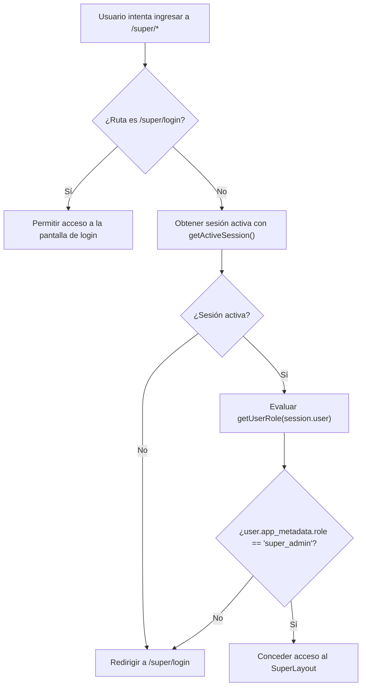

# Módulo Super Administrador y Plataforma (/super, Landing, Registro y Login)

Este documento describe la arquitectura, componentes, flujos de seguridad y herramientas de gestión del panel Super Administrador y de las páginas de captación/acceso en la plataforma **DIZI**.

---

## 1. Visión General del Módulo Super Admin

El módulo `/super/*` es el centro de control para los administradores y fundadores de DIZI, permitiendo la supervisión global de tiendas, analíticas de negocio (MRR), soporte técnico a comerciantes y gobernanza de planes.

| Ruta | Archivo Fuente | Propósito |
|---|---|---|
| `/super` | `src/routes/super.tsx` | Layout maestro con barra lateral y guardia de seguridad estricto para rol `super_admin`. |
| `/super/login` | `src/routes/super.login.tsx` | Pantalla de inicio de sesión dedicada para el equipo de administración. |
| `/super/dashboard` | `src/routes/super.dashboard.tsx` | Métricas generales del SaaS, cálculo de MRR, distribución de planes y gráficos. |
| `/super/tiendas` | `src/routes/super.tiendas.tsx` | Directorio maestro de tiendas, filtros, auditoría, suplantación y gestión de suscripción. |
| `/super/promociones` | `src/routes/super.promociones.tsx` | Gestor de precios promocionales, descuentos temporales y etiquetas de oferta. |
| `/super/referidos` | `src/routes/super.referidos.tsx` | Registro y control de recompensas del programa de referidos entre comercios. |

---

## 2. Guardia de Seguridad y Control de Acceso (`src/routes/super.tsx`)

Todas las rutas dentro de `/super/*` (con excepción de `/super/login`) están blindadas por un guardia `beforeLoad`:

### Características del Guardia:
- **Almacenamiento seguro de roles**: El rol `super_admin` se almacena en `auth.users.app_metadata` en Supabase, el cual no puede ser modificado por el usuario cliente desde la API pública.
- **Fallback síncrono offline**: Si falla la llamada de red hacia Supabase, `getSessionSync()` verifica el token en `localStorage` antes de rechazar la conexión.

---

## 3. Panel de Métricas y Analítica SaaS (`super.dashboard.tsx`)

Muestra la salud comercial y el crecimiento de la plataforma:

1. **Métricas Clave (KPIs)**:
   - *Total de tiendas registradas* y desglose por estado: activas, en prueba (*trial*), suspendidas o canceladas.
   - *MRR (Monthly Recurring Revenue)*: Cálculo dinámico de ingresos recurrentes mensuales proyectados basándose en los planes vigentes (`PLANS[p].price`) y tarifas personalizadas (`customPrice`).
   - *Volumen de catálogo*: Total de productos activos en la plataforma.
   - *Interacciones globales*: Clics acumulados hacia WhatsApp y visitas recibidas por los catálogos.
2. **Visualización Gráfica (Recharts)**:
   - Distribución de tiendas por plan comercial mediante gráfico circular (*PieChart*).
   - Evolución y tendencias de crecimiento mediante gráficos de área (*AreaChart*).

---

## 4. Gobernanza de Tiendas y Modo Suplantación (`super.tiendas.tsx`)

Herramienta de soporte y auditoría técnica:

- **Buscador y Filtros**: Búsqueda por nombre de negocio, slug o correo del propietario; filtros por plan (`semilla`, `emprendedor`, `pro`, `ilimitado`) y estado de vigencia.
- **Modo Suplantación (*Impersonation*)**:
  - Al presionar "Ingresar como tienda", se ejecuta `startImpersonation(storeId)`.
  - El Super Admin se traslada inmediatamente al `/admin/dashboard` de ese comercio con permisos completos para configurar el catálogo, verificar errores o ayudar al cliente.
  - Una barra flotante superior le permite regresar al panel super-admin con un solo clic (`stopImpersonation()`).
- **Integración con `SubscriptionManager`**:
  - Permite activar planes manualmente, canjear invitaciones, extender meses adicionales o conceder días de prueba gratuita.

---

## 5. Captación Pública y Onboarding de Comercios

Además del panel administrativo, esta fase comprende las rutas públicas de entrada y conversión:

### 5.1 Landing Page (`src/routes/index.tsx`)
- Presentación de la propuesta de valor: *"Crea tu Catálogo Digital y vende directo por WhatsApp sin comisiones"*.
- Simulador interactivo del catálogo en tiempo real.
- Tabla comparativa de precios y características de los planes.
- Sección de preguntas frecuentes (FAQ) y testimonios de clientes reales.

### 5.2 Registro de Comercios (`src/routes/register.tsx`)
- Flujo guiado de registro de usuario y tienda.
- Validación asíncrona de disponibilidad del slug en tiempo real para evitar duplicados.
- Creación del usuario en Supabase Auth (`signUp`).
- Ejecución de la función RPC `initialize_store` que crea atómicamente la tienda, la categoría inicial y siembra productos de muestra (`is_sample: true`) para que el catálogo no inicie vacío.

### 5.3 Inicio de Sesión (`src/routes/login.tsx`)
- Autenticación con correo electrónico y contraseña (`signInWithEmail`).
- Detección automática del rol tras el inicio de sesión: redirige al Super Admin a `/super/dashboard` y a los comercios a `/admin/dashboard`.
- Modal de recuperación de contraseña con enlace directo a correo (`resetPasswordForEmail`).
