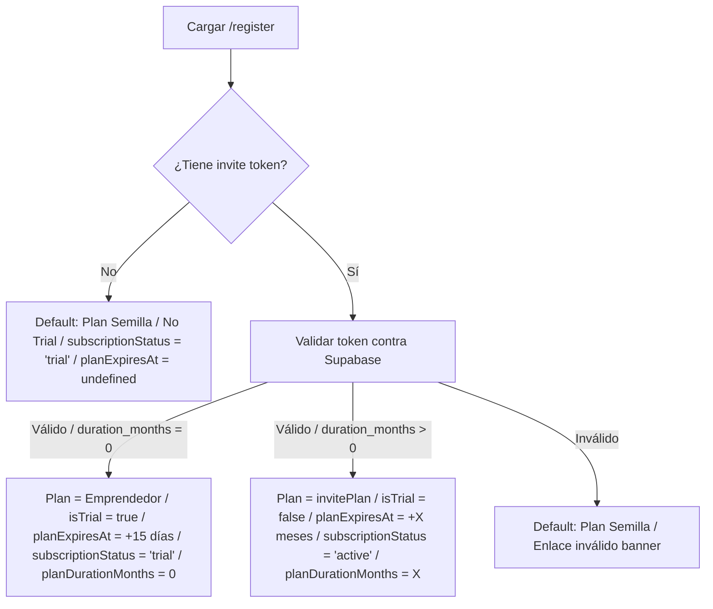

# Arquitectura y Flujo de Planes y Suscripciones (Dizi)

Este documento detalla la lógica de negocio y las conexiones técnicas entre la Landing Page, el Flujo de Registro, el Generador de Invitaciones y la Base de Datos con respecto a los planes y períodos de prueba.

---

## 1. Planes Disponibles

Los planes están definidos en `src/lib/types.ts` bajo la constante `PLANS`:

| Plan | Límite de productos | Precio actual (`PLANS[].price`) |
|---|---|---|
| **Semilla** | 7 | Gratis (0) |
| **Emprendedor** | 50 | S/ 9.90/mes |
| **Pro** | 200 | S/ 14.90/mes |
| **Ilimitado** | Ilimitado | S/ 34.90/mes |

> ⚠️ **Los precios S/ 9.90 (Emprendedor) y S/ 14.90 (Pro) son PROMOCIONALES de lanzamiento.** Están hardcodeados como precio único en `types.ts`, así que hoy no se distinguen de un "precio regular". Cambiarlos afecta a la vez a `admin.plan.tsx` y al panel del superadmin (`SubscriptionManager.tsx`). La **landing** (`index.tsx`) tiene los precios escritos a mano aparte y hay que editarla por separado. La evaluación para hacer la promo gestionable desde el área de super está en `ARQUITECTURA.md` § 20.
>
> Recordatorio: la app **no cobra** (no hay pasarela); el precio es informativo y para el cálculo estimado de renovación. El cobro real se coordina por WhatsApp.

---

## 2. Flujos desde la Landing Page (`index.tsx`)

En la sección de Oferta de Lanzamiento del Plan Emprendedor (15 Días Gratis) existen dos botones con comportamientos distintos:

### A. Botón "Solicitar por WhatsApp" (Flujo Recomendado de Prueba)
- **Destino**: `https://wa.me/...` con el mensaje predefinido: *"Hola, quiero probar Dizi y que me ayuden a configurar mi catálogo"*.
- **Propósito**: Conectar al usuario con el administrador. El administrador le dará soporte y le enviará un **enlace de invitación de prueba** generado desde el panel de superadmin.
- **Resultado final**: El usuario se registra utilizando el enlace de invitación y obtiene la **prueba de 15 días gratis del Plan Emprendedor**.

### B. Botón "Registrarme solo" / Registro Directo
- **Destino**: `/register` (sin parámetros en la URL).
- **Propósito**: Permitir que los usuarios que deseen autogestionarse se registren de inmediato.
- **Resultado final**: Al no contar con un token de invitación en la URL, el registro público **asigna por defecto el Plan Semilla (Gratuito)**.
- **Importancia**: Esto previene el abuso de cuentas premium de prueba generadas automáticamente sin contacto humano.

---

## 3. Generación de Invitaciones (`InviteGenerator.tsx`)

El superadmin puede generar enlaces de invitación para cualquier plan y duración:
- Se agregó la opción **"15 días (Prueba)"** con un valor de duración de **`0` meses**.
- Se definió de forma local en el componente (`INVITE_DURATION_OPTIONS`) para evitar contaminar las opciones de renovación o extensión del panel general.
- Al generar una invitación para el Plan Emprendedor, la opción de prueba de 15 días (`0` meses) viene seleccionada por defecto.
- El enlace generado tiene la estructura: `/register?invite=TOKEN`.

---

## 4. Flujo de Registro (`register.tsx`)

Cuando la página de registro se carga, verifica si existe el parámetro `invite` en la URL:



---

## 5. Lógica del Store y Persistencia en Supabase (`store.ts`)

### A. Registro Público (Semilla)
Al llamar a `addStore`, se ejecuta el procedimiento almacenado `initialize_store` de PostgreSQL. Como el plan es semilla, la base de datos establece por defecto `subscription_status = 'trial'` y `plan_expires_at = null` (no expira).

### B. Registro mediante Enlace de Invitación de Prueba (15 días)
Cuando `duration_months` es `0`:
1. En `register.tsx`, la tienda local se inicializa con `planExpiresAt` a 15 días en el futuro, `subscriptionStatus: "trial"` y `planDurationMonths: 0`.
2. `addStore` ejecuta `initialize_store` y posteriormente realiza un `update` para guardar estos campos específicos de prueba en Supabase.
3. Se invoca a `markInviteUsed(inviteToken, newStoreId)`.
4. `markInviteUsed` llama al RPC `activate_subscription` en PostgreSQL. Para evitar que el RPC expire el plan inmediatamente (ya que recibe un `0` de duración en meses), el frontend le pasa temporalmente `1` mes al RPC.
5. Inmediatamente después del RPC, el frontend ejecuta un `update` en la tabla `stores` para sobrescribir y asegurar los valores de prueba reales:
   - `plan_expires_at` = fecha de expiración calculada a 15 días.
   - `subscription_status` = `'trial'`.
   - `plan_duration_months` = `0`.
6. Se actualiza el estado de Zustand con estos mismos campos.

---

## 6. Visualización del Período de Prueba en el Admin

Para diferenciar una tienda en el Plan Semilla (que tiene estado de suscripción `trial` en base de datos pero no expira) de una tienda con prueba premium activa de 15 días, se utiliza la siguiente condición en el frontend:

```typescript
const isTrial = store.subscriptionStatus === "trial" && store.plan !== "semilla";
```

### Dashboard (`admin.dashboard.tsx`)
- Muestra el nombre del plan como **`Emprendedor (Prueba)`** si `isTrial` es verdadero.
- La descripción de la tarjeta de Plan Actual muestra: *"Prueba: quedan X días"*.

### Mi Plan (`admin.plan.tsx`)
- Muestra un banner ámbar premium (`bg-amber-50/60 border-amber-200`) con un icono de reloj (`Clock`) e indica: *"Período de prueba activo hasta [fecha] ([X] días restantes)"*.
