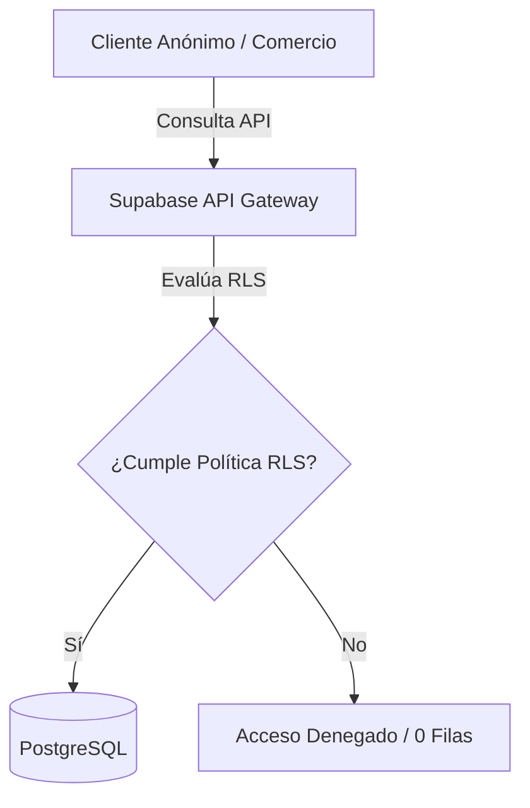

# Manual de Ciberseguridad y Hardening — DIZI SaaS

Este documento recopila de manera detallada la arquitectura de seguridad, la configuración de variables de entorno, las políticas de base de datos (RLS), la protección contra escalada de privilegios y las mejores prácticas defensivas implementadas en la plataforma **Dizi**.

---

## 1. Protección de Archivos y Variables de Entorno (.env)

El control de credenciales y tokens se gestiona bajo el principio de privilegios mínimos y aislamiento estricto:

### A. Exclusión en Control de Versiones (`.gitignore`)

Los archivos de variables de entorno locales están protegidos contra subidas accidentales a repositorios de Git. El archivo [.gitignore](file:///c:/Users/JACK%20FRANKLIN/Desktop/Proyectos%20Idenza/Catalogo%20Dinamico%20SAAS/catalog-connect-main/.gitignore) tiene las siguientes reglas explícitas:

```text
# Environments and Secrets
.env
.env.local
.env.production
.env.development
*.key
```

> [!IMPORTANT]
> Nunca se deben subir estos archivos a GitHub. Las variables correspondientes a producción deben cargarse manualmente en la interfaz del proveedor de hosting (ej. Vercel o Cloudflare Pages).

### B. Aislamiento Cliente-Servidor en Vite

Vite divide las variables de entorno de forma segura al compilar el bundle del navegador:

1. **Públicas (`VITE_`):** Las variables con prefijo `VITE_` (como `VITE_SUPABASE_URL` y `VITE_SUPABASE_ANON_KEY`) se inyectan en el cliente. Son seguras de exponer ya que las tablas de base de datos están protegidas por RLS.
2. **Privadas:** Las variables sin este prefijo (como `WHAPI_TOKEN`) se mantienen **exclusivamente en el lado del servidor** (process.env) durante el desarrollo local y compilación, y nunca se inyectan en el archivo JS que descarga el usuario.

---

## 2. Aislamiento Multitenant y Políticas RLS (Supabase)

La base de datos ejecuta **Row Level Security (RLS)** para garantizar que un comercio jamás pueda acceder ni alterar la información de otro comercio o usuario.



### A. Políticas en la Tabla `stores` (Comercios)

- **Lectura Pública:** Limitada únicamente a registros donde `active = true` e `is_published = true`. Esto evita que tiendas suspendidas por falta de pago o en modo borrador sean vistas en la web.
- **Mutaciones (INSERT, UPDATE, DELETE):** Restringidas por la condición `auth.uid() = owner_id`. Solo el usuario autenticado que creó la tienda puede editarla.
- **Superadmin:** Bypass completo mediante la comprobación del rol `super_admin` en PostgreSQL.

### B. Blindaje de Invitaciones (`invites`)

- **Acceso de Tabla Cerrado:** Se eliminó la política pública de lectura de la tabla de invitaciones para evitar que un usuario liste todos los enlaces promocionales activos y sus notas internas.
- **Validación de Registro por RPC:** Se implementó una función segura `SECURITY DEFINER` llamada `check_invite(p_token)`. El cliente solo puede validar un token de forma "ciega" enviando el código exacto de 36 caracteres. Si coincide, no está vencido y no ha sido usado, devuelve los datos del plan; en caso contrario, devuelve un resultado vacío.

---

## 3. Prevención de Escalación de Roles (Authorization Bypass)

Para evitar que un cliente se asigne privilegios administrativos manipulando metadatos o llamados de API:

1. **Trigger de Sincronización en `auth.users`:**
   - El trigger `trg_user_sync_role` intercepta todos los inserts y updates en el motor de autenticación.
   - Si un usuario intenta enviar un rol `super_admin` en sus metadatos públicos (`raw_user_meta_data`), el trigger lo sobrescribe forzándolo a `store_owner`.
2. **Metadatos de Aplicación Firmados (`app_metadata`):**
   - El rol real de administración (`super_admin`) se almacena en `raw_app_meta_data`. Estos metadatos viajan firmados criptográficamente dentro del token JWT de Supabase, por lo que el navegador no puede modificarlos.
3. **Verificación de Rol en Funciones Críticas:**
   - Las funciones SQL de suscripción (`activate_subscription`, `cancel_subscription`, `extend_subscription`) validan el rol interno en el JWT antes de ejecutarse:
     ```sql
     IF auth.role() != 'service_role' AND COALESCE((auth.jwt()->'app_metadata'->>'role'), '') != 'super_admin' THEN
       RAISE EXCEPTION 'No autorizado.';
     END IF;
     ```

---

## 4. Seguridad en Capa Web (CSP, HSTS y Servidor Local)

### A. Cabeceras HTTP de Producción (`vercel.json`)

Las cabeceras configuradas en la plataforma de despliegue protegen al cliente final contra inyecciones XSS y secuestros de clics:

- **Content-Security-Policy (CSP):** Restringe la carga de recursos (scripts, imágenes, fuentes, estilos) exclusivamente a dominios de confianza preestablecidos (Supabase, Leaflet, Unsplash, WhatsApp).
- **Strict-Transport-Security (HSTS):** Fuerza la comunicación únicamente bajo HTTPS previniendo ataques Man-in-the-Middle y downgrades.
- **Permissions-Policy:** Desactiva micrófonos, cámaras y APIs de pago no necesarias en el catálogo del cliente.

### B. Directory Traversal en Local

El servidor de desarrollo local configurado en [vite.config.ts](file:///c:/Users/JACK%20FRANKLIN/Desktop/Proyectos%20Idenza/Catalogo%20Dinamico%20SAAS/catalog-connect-main/vite.config.ts#L25-L31) intercepta las rutas `/api/*` y verifica que no existan secuencias de escape de directorios:

```typescript
if (endpoint.includes("..") || endpoint.includes("/") || endpoint.includes("\\")) {
  return next();
}
```

Esto evita que peticiones locales malformadas intenten leer archivos del sistema fuera del directorio de trabajo.

---

## 5. Checklist de Seguridad para Futuros Despliegues

Cuando traslades la aplicación de tu entorno local de desarrollo a producción, asegúrate de cumplir con los siguientes pasos:

- [ ] **Desactivar el registro público de Supabase en producción:** Limita el registro de usuarios únicamente a través de la interfaz oficial de Dizi para evitar inserciones directas vía consola.
- [ ] **Configurar CORS en Supabase:** Restringe los dominios permitidos para llamadas API y buckets de almacenamiento únicamente a tus dominios definitivos (ej. `dizi.pe` y `app.dizi.pe`).
- [ ] **Monitorear claves de API:** Asegúrate de que las API Keys de servicios externos (como tokens de mensajería de WhatsApp) se almacenen como secretos de entorno en la consola de Vercel/Cloudflare y no de forma estática en archivos JS.
